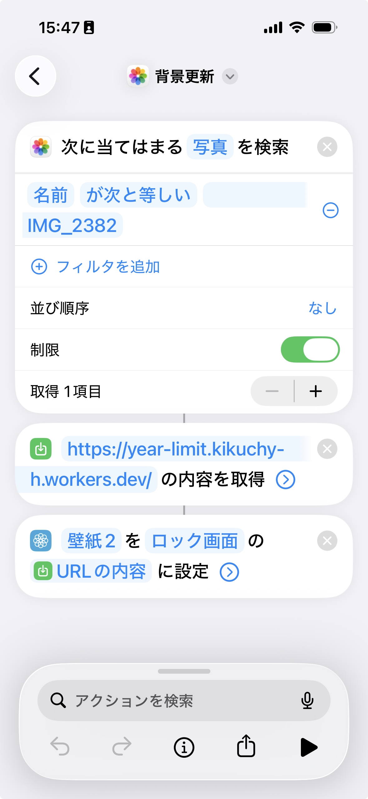
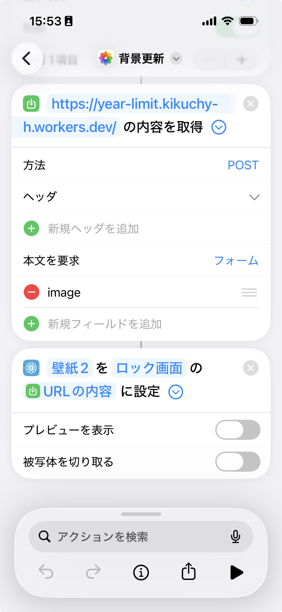
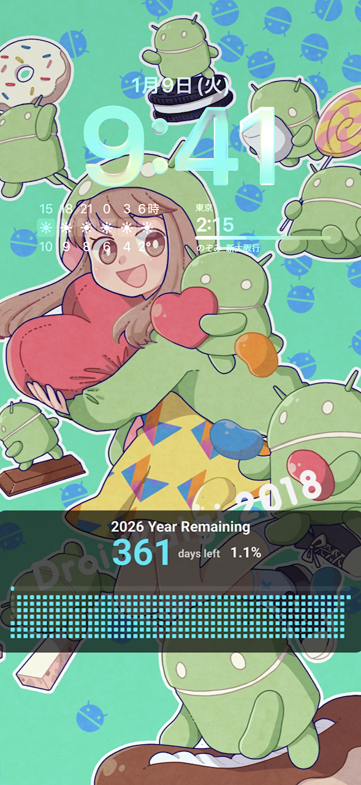

# Year Limit

あなたの好きな背景画像に、1年の残り日数と進捗を合成して表示できるようにするサービスです。

## 概要

Year Limit は、一年の残り日数と進捗率（％）を計算し、美しいインジケーターとして背景画像に合成する Cloudflare Worker アプリケーションです。
スマートフォンの壁紙などとして利用することを想定しています。

## 主な機能

- **進捗の視覚化**: 一年の残り日数、残りパーセンテージ、および日ごとのグリッド（GitHub風のタイル）を表示します。
- **背景のカスタマイズ**: `POST` リクエストで独自の画像をアップロードし、合成の背景として使用できます。
- **マルチフォーマット対応**: デフォルトで `PNG` 形式の画像を生成しますが、クエリパラメータを指定することで `SVG` 形式での取得も可能です。
- **自動スケーリング**: アップロードされた画像の解像度に合わせて、インジケーターのサイズを自動的に調整します。

## 技術スタック

- **Runtime**: [Cloudflare Workers](https://workers.cloudflare.com/)
- **Language**: TypeScript
- **Image Processing**:
    - `svg2png-wasm`: SVG から高品質な PNG への変換
    - `jpeg-js`: JPEG 画像の解析（サイズ取得）
- **Layout**: SVG テンプレートエンジンによる動的レイアウト

## 使い方

### カスタム背景での画像生成 (POST)

自分の好きな画像を背景として使用します。
iOSの「ショートカット」から画像をPOSTして、自動で更新できるようにするのがおすすめです。

ショートカットの例:
| 写真の取得 | 写真への合成と背景設定 |
|---|---|
|||

|設定例|
|---|
||

リクエスト例:
```bash
curl -X POST -F "image=@your_image.jpg" https://year-limit.kikuchy-h.workers.dev/ > result.png
```

- **制限**: アップロード可能なファイルサイズは最大 **5MB** です。

## 開発

### セットアップ

```bash
npm install
```

### ローカル開発

```bash
npm run dev
```

### デプロイ

```bash
npm run deploy
```
